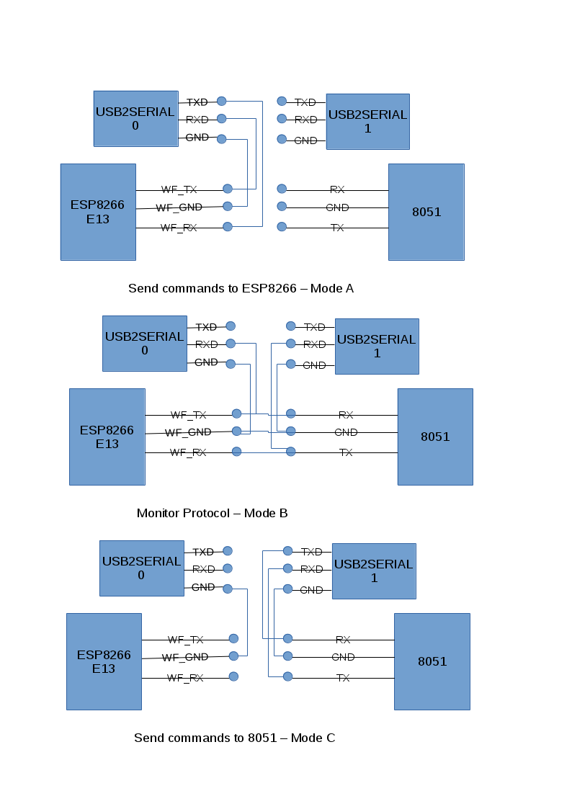

# Serial Connections
Break out the serial header to a breadboard with the USB to Serial converters plugged in. You can the patch from the BBT5 to the bread board for the 3 modes shown in the diagram.

A minicom terminal runs on each USB to Serial port. Linux finds them at /dev/ttyUSB0 and /dev/ttyUSB1 or something similar. Minicom should be set to 115200baud 8N1 Hardware handshake off.

## Mode A Sending commands to the ESP8266
This is used to initially set up the WiFi connection of the ESP. Connected in this way, the board beeps continuously, or until it sees a successful Wifi connection.

## Mode B Monitoring the protocol
The USB to sertial converters listen to the transmit of each microcontroller. A minicom terminal runs on each each and displays the text activity between the uControllers. Luckily the protocol is ASCII.


## Mode C Sending commands to the 8051
This is used to send the commands to the 8051. Typing in the terminal does not echo unless local echo is turned on in minicom. For example, to stop the beeping the following commands can be sent to fool it into thinking WiFi has connected successfully.
```
WIFI CONNECTED
WIFI GOT IP
```




